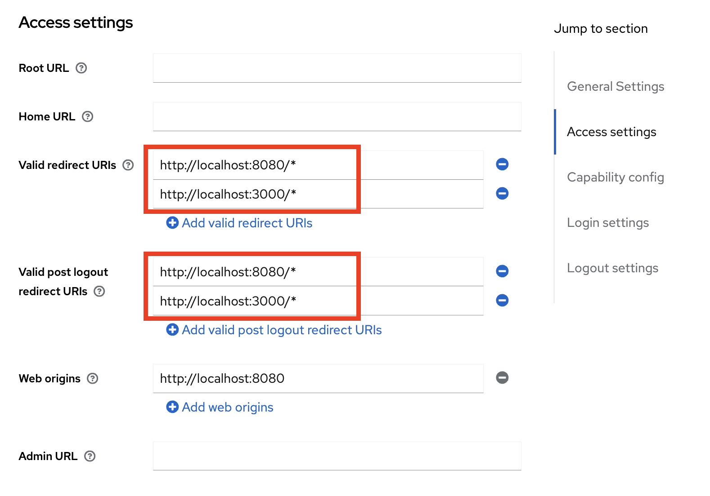

# Reference
**Keycloak**  
https://www.baeldung.com/?s=keycloak  
https://www.baeldung.com/spring-boot-keycloak  
https://www.baeldung.com/keycloak-oauth2-openid-swagger

**Markdown (.md)**  
https://markdownguide.org/basic-syntax  
https://markdownguide.org/extended-syntax


# Error "finished with non-zero exit value 1"
Process 'command '/Library/Java/JavaVirtualMachines/jdk1.8.0_121.jdk/Contents/Home/bin/java'' finished with non-zero exit value 1  
https://noame123.medium.com/spring-boot-execute-error-finished-with-non-zero-exit-value-1-5e8317e6ad92


# Keycloak
## Setup
https://keycloak.org/server/containers  

> docker run --name keycloak-server -p 38180:8080 \  
> -e KEYCLOAK_ADMIN=admin -e KEYCLOAK_ADMIN_PASSWORD=keycloak \  
> quay.io/keycloak/keycloak:21.1 \  
> start-dev

> login: admin  
> password: keycloak


## Create New Realm





## PKCE Setup
Clients -> Advanced -> Advanced Settings -> Proof Key for Code Exchange Code Challenge Method  


## Export and Import
### Reference
https://howtodoinjava.com/devops/keycloak-export-import-realm/
https://howtodoinjava.com/devops/keycloak-script-upload-is-disabled/


### Preparation
Remove the `authorizationSettings` block in the *realm.json files


### Export
docker ps -a
docker exec -it [container-id] bash
> ###example  
> docker exec -it e5c79daf5235 bash

execute export commands
> cd /opt/keycloak  
> ###including both realm and users data  
> ###./kc.sh export --dir /tmp/keycloak-all-data-[yyyyMMdd]-[hh:mm]  
> ./kc.sh export --dir /tmp/keycloak-all-data-20230623-1020  
> exit  


docker cp [container-id]:/tmp/keycloak-all-data-[yyyyMMdd]-[hh:mm] /local-somewhere-eg-tmp/
> docker cp e5c79daf5235:/tmp/keycloak-all-data-20230623-1145 ~/Documents/development/artifact/keycloak/data-20230623-1145


### Import
Need to create the realm and import users manually with exported files  


## Timeout
### Token timeout
Select the target realm, goto Realm settings.
  
  


# Postman
## Working Offline  
Click setting and then select `Scratch Pad`  


## Keycloak openid-configuration
According to the version of keycloak after `v 17.0 and newer`.  
The url of openid-configuration api has been changed, `/auth` is removed.   
**From:** {{server}}/auth/realms/{{realm}}/.well-known/openid-configuration
**To:** {{server}}/realms/{{realm}}/.well-known/openid-configuration
https://www.baeldung.com/postman-keycloak-endpoints

**api:** {{idp-server}}/realms/{{client-realm}}/.well-known/openid-configuration  


## Authorization Code (with PKCE)
Authorization -> Grant type  
Change `Grant type` to use `Authorization Code (with PKCE)`  


## Environment Variables Setup for Keycloak
environment variables preparation  
> **app-server:** http://localhost:28080  
> **client-id:** react-backend-client-01  
> **client-secret:** ${client-secret}  
> **client-realm:** react-backend-realm  
> **idp-server:** http://localhost:38180  
> **idp-redirect_uri:** {{app-server}}/v1/public/authorized  
> **idp-auth-url:** {{idp-server}}/realms/{{client-realm}}/protocol/openid-connect/auth  
> **idp-access-token-url:** {{idp-server}}/realms/{{client-realm}}/protocol/openid-connect/token

  


## Collection auth setup
> **token name:** access_token  
> **grant type:** Authorization Code  
> **callback url:** {{idp-redirect_uri}}  
> **auth url:** {{idp-auth-url}}  
> **access token url:** {{idp-access-token-url}}  
> **client id:** {{client-id}}  
> **client secret:** {{client-secret}}  

  


# Gradle
## bootRun Setup
Prepare the following environment variables for bootRun
> client-id=[client-id];client-secret=[client-secret];client-realm=[client-realm];oauth2.client.keycloak=[keycloak-host];spring.profiles.active=[spring profile]

> client-id=oauth-client-01  
> client-secret=XXX  
> client-realm=oauth-client-realm  
> oauth2.client.keycloak=http://localhost:38180  
> spring.profiles.active=dev  


## gradlew bootRun
```shell
./gradlew bootRun --debug --args='--client-id=oauth-client-01 --client-secret=XXX --client-realm=oauth-client-realm --oauth2.client.keycloak=http://localhost:38180 --spring.profiles.active=dev'
```

